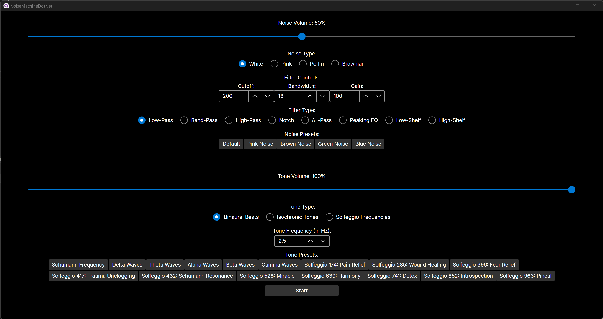

# Noise Machine .NET

Made for both relaxation and tinkering, using the Avalonia UI.
Noise can be adjusted with a filter (coming soon, not implemented yet) of variable settings, like low-pass, band-pass, and high-pass. The tone is a sine wave that can be binaural beats, isochronic tones, or solfeggio frequencies.
Built for .NET 8 or higher.

## Available noise types

- White (kind of loud)
- Pink (loud)
- Brownian (moderately quiet)

## Available tone types

- Binaural beats (right ear = left ear + set frequency)
- Isochronic tones (volume goes on and off at a rate of the set frequency)
- Solfeggio frequencies (tone is at the set frequency)

## Licenses

- Project is under the GNU GPL 3.0 or later license.
- Individual code and components are under the GNU Lesser GPL 3.0 or later license unless specified.
- [mackron/miniaudio](https://github.com/mackron/miniaudio) is under the public domain or MIT no-attribution license.
-- Bindings to Miniaudio are generated using ClangSharp which is under the MIT license.
- AvaloniaUI is under the MIT license.

## Platforms

- Windows (only tested on x86_64)
- Android
- macOS (only tested on Apple Silicon)
- Windows on ARM (untested)
- Web (problematic build)
- iOS (problematic build)
- Linux (untested)

## Required workloads/components

- .NET desktop development
- Desktop development with C++
- Mobile development with C++ (including iOS development tools and Android NDK)
- Linux and embedded development with C++
- .NET SDK for available platforms
- Clang/LLVM, including llvm-dev on Linux
- Xcode (when on macOS)
- Missing tools can be gotten with the `dotnet workload restore` command when done on the directory with the .sln file.
- When on Ubuntu, run `sudo apt install libx11-6 libice6 libsm6 libfontconfig1`

## Building Miniaudio

The Miniaudio source code is included as a git submodule, and bindings are automatically generated during prebuild using ClangSharp. The process of compiling Miniaudio is automated via an msbuild prebuild event in various .csproj files.

Miniaudio is compiled as a DLL if the host machine is Windows, or a .so file if Linux. In the commands, the `&#xD;&#xA;` is a line break. The Windows part executes `cl.exe`, a command-line tool that uses MSVC on an individual code file, and the `/LD` flag specifies the output as a DLL file. `/Fe` and `/Fo` are output flags. On the Linux part, it uses a specific GCC cross-compiler depending on which target platform is specified. For example, if "x64" is set, the final command is `x86_64-linux-gnu-gcc -shared -o libs/x64/miniaudio_linux.so ../extern/miniaudio.c -lpthread -lm -ldl`.

For Linux, LibClang and LibClangSharp must be manually merged with the ClangSharpPInvokeGenerator. To do that, copy each .so file from the .nupkg files of LibClang and LibClangSharp into `~/.dotnet/tools/.store/clangsharppinvokegenerator/[version]/clangsharppinvokegenerator/[version]/tools/net8.0/any`.

The desktop app builds Miniaudio based on the host architecture if `AnyCPU` is specified as the target. To build for other architectures in the command line, go to `NoiseMachineDotNet.Desktop` and enter `dotnet build /p:Platform=` and add either `arm32`, `arm64`, `x64`, or `x86` to the end of that command before executing.
